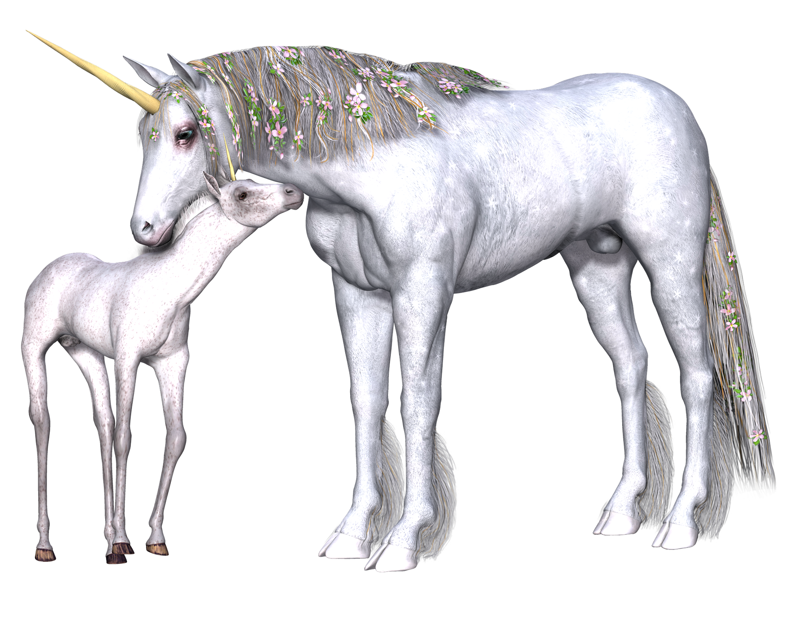

Single season occupancy model tutorial
================
Allison K. Pierce
8/19/2019

Before we get started we need to load in the R package ‘unmarked’ needed
for this coding tutorial. Make sure you install this packages first
before you try to load it. You can install the package by running this
command:

> install.packages(“unmarked”)

``` r
### Code in this chunk loads some custom function and the R libraries we need for the rest of the tutorial
library(unmarked)
```

    ## Loading required package: lattice

    ## Loading required package: parallel

    ## Loading required package: Rcpp

    ## Loading required package: reshape2

# Exploring study design with simulated data

When designing an occupancy survey you need to decide how many sites or
plots to survey and how many times you will visit each site in order to
get a good estimate of occupancy that addresses your goals for the
study. This might depend on practical matters such as number of
available surveyors, time available to do surveys, money for pay and
travel, etc. However, there are other considerations as well. Is the
area of interest very large or small? Is the organism you are studying
easy to detect or very cryptic? Is the organism common or rare? At what
spatial or temporal scale can you reasonably assume the organism is not
moving in and out of the site (closure)?

These are just a few of the important questions you should think about
when designing an occupancy study. One way to help inform these
decisions is to do a pilot survey which can help give you an idea on the
detectability of the organism and how feasible it is to visit N number
of plots across the study area. This can be especially useful if you are
unfamiliar with the organism and/or study area but does require
additional time.

Alternatively, or in addition to a pilot survey, we can use R to
simulate data using pre-set occupancy probabilities and detection
probabilities. This way we can evaluate how well we can expect to
estimate occupancy and detection under different scenarios. Not only
will this help to design more effcient surveys it will also help us
understand the modelling process.

## Simulating occupancy surveys

First we will start with a simple presence/absence only example where we
are just estimating occupancy and detection probabilities. The nice
thing about a simulation is we can set and know the TRUE occupancy and
detection probabilities and compare them to the estimates from the
model. We can then do experiments ‘in silico’ (in the computer) to
change the number of sites, visits, or any other aspect of the
simulation to see how they affect the model’s ability to accurately and
precisely estimate the true preset occupancy and detection
probabilities.

We will be simulating data many times in this tutorial. To save a lot of
typing I wrote a custom function. Writing functions is beyond the scope
of this tutorial so all you really need to know is how to use it and
what it outputs. The ‘simoccudata’ function will generate stochastic
detection histories based on preset values for number of sites, number
of visits, true occupancy (psi), and true detection (p). Even if you
keep all the presets the same you will get a different set of detection
histories each time you run the function but this is consistent with the
variation seen from sampling error which occurs anytime we only measure
a sample of the whole population (or in this case only visit a sample of
sites instead of the entire study
area).

``` r
# custom function that simulates detection histories for a specfied number of sites and visits from known occupancy and detection probabilities
simoccudata <- function(nsites, nvisits, psi, p){
  studyarea <- matrix(NA, 100, 100)
  
  #y is the observed detections
  y <- matrix(NA, nsites, nvisits)
  
  #z is the true occupancy at each site
  z <- rbinom(nsites, 1, psi)
  
  for(i in 1:nsites){
    y[i,] <- rbinom(nvisits, 1, z[i] * p)
  }
  y
}
```

Let’s simulate some data\! Let’s assume we have an organism that’s
pretty easy to detect like a unicorn. It has a big horn, white, sparkly,
and is pretty large.



Maybe if it’s laying down we might not see it so let’s say 80% of the
time we will detect it if its there. Let’s also assume we are surveying
a unicorn preserve, even though the area is protected unicorns are not
very common and only occupy 20% of the sites in the preserve. The
unicorns breed in meadows and are never seen in the forested areas
likely because thier long horns get easily tangled in branches. There
are over 1000 meadows in the preserve and it would be nearly impossible
to survey them all before the 5 week breeding season ends and they leave
the preserve. So let’s start out by simulating data for visiting 200
randomly selected meadows that we visit 5 times (once a week).

``` r
#constant p and psi
p <- 0.8
psi <- 0.2

set.seed(42)

y <- simoccudata(nsites = 200, nvisits = 5, psi = psi, p = p)
head(y)
```

    ##      [,1] [,2] [,3] [,4] [,5]
    ## [1,]    0    1    0    1    1
    ## [2,]    1    0    1    1    1
    ## [3,]    0    0    0    0    0
    ## [4,]    1    1    1    1    1
    ## [5,]    0    0    0    0    0
    ## [6,]    0    0    0    0    0

In the simulated data, 0 means we saw no unicorns in the meadow in that
visit and 1 means we saw at least 1 unicorn in the meadow during the
visit. Each row is the full detection history for a meadow and each
column is one visit/survey.

## Fitting a single season occupancy model to simulated data

The ‘unmarked’ package in R is a popular tool for modeling occupancy in
R that has a lot of documentation and support resources but there are
other tools availble both in and outside of the R program. This package
also has functions for other kinds of models to estimate presence and
abundance that is beyond the scope of the workshop. To use the occupancy
modeling functions in ‘unmarked’ we need to format our data in a special
way using the ‘unmarkedFrameOccu’ function and save it as a new object.
We can get a summary of the new object to check our data was reformatted
correctly. This will also tell us how many detections we had.

``` r
occdata <- unmarkedFrameOccu(y=y)
summary(occdata)
```

    ## unmarkedFrame Object
    ## 
    ## 200 sites
    ## Maximum number of observations per site: 5 
    ## Mean number of observations per site: 5 
    ## Sites with at least one detection: 40 
    ## 
    ## Tabulation of y observations:
    ##   0   1 
    ## 841 159

Looks good so let’s fit some models\! For a single season model we will
use the ‘occu’ function in ‘unmarked’. With a single season occupancy
model we are estimating 2 state variables, occupancy probability and
detection probability. We need to supply a formula for each state
variable that describes how mean detection and occupancy varies. First
we will start with the simplest model that mean detection and occupancy
is constant and doesn’t vary as a function of site, visit, etc. This is
denoted with the ‘~1’ formula repeated twice in the function call. In
the ‘occu’ function the first formula describes detection and the second
occupancy. We can get a brief summary of the model results using the
‘summary’ function.

``` r
#Detection and occupancy probability is constant
dotmodel <- occu(~1 ~1, data = occdata)
summary(dotmodel)
```

    ## 
    ## Call:
    ## occu(formula = ~1 ~ 1, data = occdata)
    ## 
    ## Occupancy (logit-scale):
    ##  Estimate    SE     z  P(>|z|)
    ##     -1.39 0.177 -7.84 4.55e-15
    ## 
    ## Detection (logit-scale):
    ##  Estimate    SE    z P(>|z|)
    ##      1.35 0.176 7.71 1.3e-14
    ## 
    ## AIC: 407.0344 
    ## Number of sites: 200
    ## optim convergence code: 0
    ## optim iterations: 26 
    ## Bootstrap iterations: 0

How is detection probability over 1? Notice that these estimates are on
the logit scale and represent log odds not probabilities. To get
probabilities we need to back transform the estimates. The
‘backtransform’ function is one easy way to do this. We can also use
the ‘confint’ function to get 95% confidence intervals for the back
transformed estimates.

``` r
#back transforms the occupancy estimate
psi_estimate <- backTransform(dotmodel, type = "state")
psi_estimate
```

    ## Backtransformed linear combination(s) of Occupancy estimate(s)
    ## 
    ##  Estimate     SE LinComb (Intercept)
    ##       0.2 0.0283   -1.39           1
    ## 
    ## Transformation: logistic

``` r
confint(psi_estimate)
```

    ##      0.025     0.975
    ##  0.1502877 0.2612792

``` r
#back transforms the detection estimate
p_estimate <- backTransform(dotmodel, type = "det")
p_estimate
```

    ## Backtransformed linear combination(s) of Detection estimate(s)
    ## 
    ##  Estimate     SE LinComb (Intercept)
    ##     0.795 0.0287    1.35           1
    ## 
    ## Transformation: logistic

``` r
confint(p_estimate)
```

    ##      0.025     0.975
    ##  0.7328793 0.8452509

With 5 visits over 200 sites we’ve done a fairly decent job estimating
the true occupancy of 0.2 and detection of 0.8. Maybe we can lighten the
workload a little and reduce our number of visits. Let’s run the same
model but simulate data across different numbers of visits ranging from
3 to 10. For now we will keep the TRUE detection and occupancy
probabilities the same. To do this we will repeat the same thing we did
above 9 times changing the number of visits. To make it less tedious we
will use a for loop in our code.

``` r
nvisits <- 3:10
simresults <- data.frame(psi = rep(NA, length(nvisits)), 
                         psi_SE = rep(NA, length(nvisits)),
                         p = rep(NA, length(nvisits)), 
                         p_SE = rep(NA, length(nvisits)))

for(i in 1:length(nvisits)){
  y <- simoccudata(nsites = 200, nvisits = nvisits[i], psi = psi, p = p)
  occdata <- unmarkedFrameOccu(y=y)
  model <- occu(~1 ~1, data = occdata)
  psi_estimate <- backTransform(model, type = "state")
  p_estimate <- backTransform(model, type = "det")
  simresults$psi[i] <- coef(psi_estimate)
  simresults$psi_SE[i] <- SE(psi_estimate)
  simresults$p[i] <- coef(p_estimate)
  simresults$p_SE[i] <- SE(p_estimate)
}

head(simresults)
```

    ##         psi     psi_SE         p       p_SE
    ## 1 0.1960583 0.02817548 0.8245849 0.03648984
    ## 2 0.2152931 0.02909022 0.8070182 0.03042555
    ## 3 0.1900302 0.02774427 0.8261847 0.02754177
    ## 4 0.1650296 0.02625115 0.7624894 0.03029278
    ## 5 0.2399985 0.03019968 0.7857114 0.02239095
    ## 6 0.2050186 0.02854702 0.8049231 0.02188053

Let’s plot the results of our simulation using the estimates and the
standard errors to get an idea of the accuracy and precision of our
results compared to the TRUE occupancy and detection probabilities.

``` r
plot(nvisits, simresults$p, 
    ylim=range(c(0,1)),
    pch=19)
# horizontal error bars
arrows(nvisits, simresults$p - simresults$p_SE,  nvisits, simresults$p + simresults$p_SE, length=0.05, angle=90, code=3)

abline(h = p, col = "red")
title("Detection probability")
```

<!-- -->

``` r
plot(nvisits, simresults$psi, 
    ylim=range(c(0,1)),
    pch=19)
# horizontal error bars
arrows(nvisits, simresults$psi - simresults$psi_SE,  nvisits, simresults$psi + simresults$psi_SE, length=0.05, angle=90, code=3)

abline(h = psi, col = "red")
title("Occupancy probability")
```

<!-- -->

Looks like we could reduce the number of our visits and still do a
decent job of estimating both parameters\! Visiting 200 meadows is still
a lot of work so can we reduce that as well? We will use the same code
as above but modify it to step through number of sites.

``` r
nvisits <- 5
nsites <- seq(from = 10, to = 200, by = 10)
simresults_sites <- data.frame(psi = rep(NA, length(nsites)), 
                         psi_SE = rep(NA, length(nsites)),
                         p = rep(NA, length(nsites)), 
                         p_SE = rep(NA, length(nsites)))

for(i in 1:length(nsites)){
  y <- simoccudata(nsites = nsites[i], nvisits = nvisits, psi = psi, p = p)
  occdata <- unmarkedFrameOccu(y=y)
  model <- occu(~1 ~1, data = occdata)
  psi_estimate <- backTransform(model, type = "state")
  p_estimate <- backTransform(model, type = "det")
  simresults_sites$psi[i] <- coef(psi_estimate)
  simresults_sites$psi_SE[i] <- SE(psi_estimate)
  simresults_sites$p[i] <- coef(p_estimate)
  simresults_sites$p_SE[i] <- SE(p_estimate)
}

head(simresults_sites)
```

    ##         psi     psi_SE         p        p_SE
    ## 1 0.1000320 0.09489892 0.7997408 0.179521868
    ## 2 0.1000026 0.06708282 0.9999710 0.001702197
    ## 3 0.3349267 0.08649249 0.6568602 0.068567871
    ## 4 0.1500327 0.05646731 0.8332370 0.068162647
    ## 5 0.2200150 0.05858717 0.8544909 0.047590423
    ## 6 0.1668012 0.04815165 0.7593871 0.060815519

Let’s plot\!

``` r
plot(nsites, simresults_sites$p, 
    ylim=range(c(0,1)),
    pch=19, ylab = "p", xlab = "Number of pastures", main = "Detection")
# horizontal error bars
arrows(nsites, simresults_sites$p - simresults_sites$p_SE,  nsites, simresults_sites$p + simresults_sites$p_SE, length=0.05, angle=90, code=3)

abline(h = p, col = "red")
```

<!-- -->

``` r
plot(nsites, simresults_sites$psi, 
    ylim=range(c(0,1)),
    pch=19,  ylab = "psi", xlab = "Number of pastures", main = "Occupancy")
# horizontal error bars
arrows(nsites, simresults_sites$psi - simresults_sites$psi_SE,  nsites, simresults_sites$psi + simresults_sites
       $psi_SE, length=0.05, angle=90, code=3)

abline(h = psi, col = "red")
```

<!-- -->

We could probably reduce the number of sites we visit but probably not
much less than 75 or so. With our simulations we guessed what the values
for TRUE occupancy and detection are but we could also simulate
scenarios where they might be higher or lower. To better understand how
sampling design affects your estimates try to make some guesses on how
increasing occupancy or lowering detection would change the number of
sites or visits you would need to estimate both parameters well. Test

When estimating occupancy the meadow is the sample unit not the
individual animals we detect so the more meadows we sample the larger
our sample size and thus power to estimate occupancy accurately and
precisely especially if we want to include covariates in the model.
Finding the balance between scientific rigor and logistic constraints is
not always straightforward but simulations and pilot studies can guide
decisions that maximise success to achieve your study objectives\!

# Unicorn Occupancy Study

## Fitting models with covariates

You have just been hired as the head biologist at the Unicorn Preserve.
Leadership wants your scientific expertise to guide decisions on what
new lands would be good to acquire to add to the preserve and land
managers would like to know what actions they can take to help maximise
continued use of meadows in the preserve by breeding unicorns. To tackle
these questions last summer you lead a team to survey 150 meadows in the
preserve each week for 4 weeks looking for unicorns. In addition to
unicorn presence your technicians also collected the following habitat
data for each meadow.

  - Grass height (categorical)
    
      - “Tall” \> 100 cm tall
      - “Mid” \> 30 cm on average
      - “Short” shorter than 30 cm on average

  - Shrub cover (%)

  - Distance to nearest water source (km)

To cover 150 meadows you hired two technicians Alex and Bob to split up
the work. Alex has worked on unicorn projects with you in the preserve
before. Bob just graduated from university but trained with Alex before
the surveys started.

Use the information above to construct a set a competing hypotheses
about unicorn occupancy in the
preserve.

## Interactive coding session - reference code visible in document source code (.Rmd)

Read in the data

``` r
unicorndata <- read.csv("unicorns.csv")
sitecovs <- read.csv("unicorn_sitecovs.csv")
obscovs <- read.csv("unicorn_obscovs.csv")

occdata <- unmarkedFrameOccu(y=unicorndata, siteCovs = sitecovs, obsCovs = obscovs)
summary(occdata)
```

    ## unmarkedFrame Object
    ## 
    ## 150 sites
    ## Maximum number of observations per site: 4 
    ## Mean number of observations per site: 4 
    ## Sites with at least one detection: 25 
    ## 
    ## Tabulation of y observations:
    ##   0   1 
    ## 527  73 
    ## 
    ## Site-level covariates:
    ##  grassheight   shrubcover         distance_w     
    ##  Mid  :66    Min.   :0.008665   Min.   :0.01864  
    ##  Short:51    1st Qu.:0.174183   1st Qu.:1.71901  
    ##  Tall :33    Median :0.315847   Median :3.00495  
    ##              Mean   :0.312389   Mean   :3.12304  
    ##              3rd Qu.:0.469594   3rd Qu.:3.98143  
    ##              Max.   :0.595456   Max.   :7.64885  
    ## 
    ## Observation-level covariates:
    ##  observer
    ##  A:303   
    ##  B:297

Fit candidate models using ‘occu’ function in ‘unmarked’ (not visible in
webpage for teaching purposes - see source for reference)

Model selection using ‘modSel’ in ‘unmarked’

Calculate evidence ratio between top two most parsimonious models

``` r
AICtable$AICwt[1]/AICtable$AICwt[2]
```

    ## [1] 19.13284

``` r
#what about first and last?
AICtable$AICwt[1]/AICtable$AICwt[11]
```

    ## [1] 159720.2

How’d we do? - Compare real parameter values to estimate from most
parsimonious model
